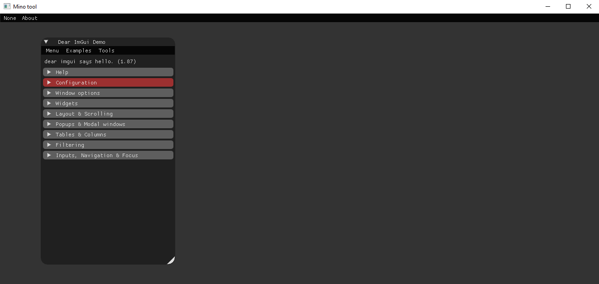
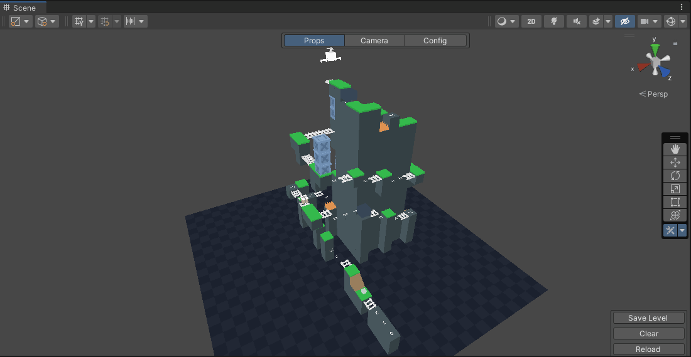
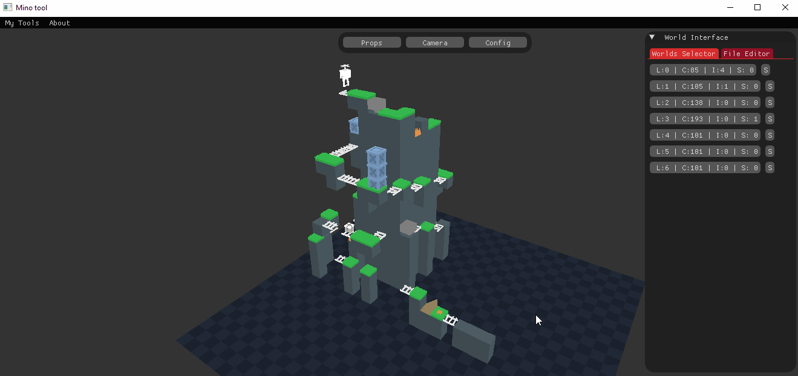

## MinoTool
A custom C# - OpenGL standalone lib to create tools easier!

### Simple UI Dear ImGui: 
If you have used it before there is not more to it apart from the easy to implement API:

Main.cs
```c#
using MinoTool;
using MinoMain;

namespace Program
{
    public class Program 
    {
        public static void Main()
        {
            Mino.Run<CustomUI>("Mino tool", 1324, 600);
        }
    }
}
```

CustomUI.cs
```c#
using MinoTool;
using MinoGUI;

namespace MinoMain
{
    public class CustomUI : MinoApp
    {
        public override void OnAppStart() 
        {
            // initialization.
        }

        public override void OnGUI()
        {
            IMGUI.ShowDemoWindow();
        }

        public override void OnToolbarGUI()
        {
            // Toolbar Ui here!
        }

        public override void OnQuit() 
        {
            // Cleanup here.
        }
    }
}
```
And this is the result:



# But is that all you can do with it? 

#### You can do some interesting tools when taking advantage of its (wip) 3D renderer.
## Here is a tool I made some time ago for my own game in Unity3D. 


## And this is the port to MinoTool:


#### just minor changes to the original Unity editor code were made to port the core of the tool!
Original, Unity3D:

```c#
using UnityEditor;

namespace LevelBuilder
{
    public class LevelBuilderPropsSidebarUI : ILevelBuilderUIMenu
    {
        public void OnGUI(B_Column column, EditorWindow window)
        {
            _column = column;

            if (column != null)
            {
                var areaRect = new Rect(x, y, width, Screen.height - offsetHeigh);

                GUILayout.BeginArea(areaRect);

                window.BeginWindows();

                var color = Color.black;
                color.a = semiTransparent;

                var drawRect = areaRect;
                drawRect.x = 0;
                drawRect.y = 0;
                drawRect.width = drawRectWidth;

                EditorGUI.DrawRect(drawRect, color);
                GUILayout.Space(5);

                GUILayout.BeginHorizontal();
                var c = GUI.color;
                GUI.color = Color.green;
                GUILayout.Label(localizedTitle);
                GUI.color = c;

                var enabled = EditorGUILayout.Toggle(column.IsHiddenPathEnabled);
                GUILayout.EndHorizontal();
                ...

```
## Port, MinoTool: OpenGl 3.3, dear Imgui

```c#
using MinoTool;
using MinoGUI;

namespace LevelBuilder
{
    public class LevelBuilderPropsSidebarUI : ILevelBuilderUIMenu
    {
        public void OnGUI(B_Column column)
        {
            if (column != null)
            {
                var areaSize = _areaSize;
                var areaPos = _areaPos; 

                IMGUI.Begin(CategoryName, ImGuiWindowFlags.NoResize | 
                                           ImGuiWindowFlags.NoMove | 
                                           ImGuiWindowFlags.NoCollapse);

                IMGUI.SetWindowSize(areaSize);
                IMGUI.SetWindowPos(areaPos);

                var width = IMGUI.GetWindowWidth() - offset;

                if (IMGUI.CollapsingHeader(MainPropsTitle, ImGuiTreeNodeFlags.DefaultOpen))
                {
                    for (int i = 0; i < _categories.MainPropsNames.Length; i++)
                    {
                        if (IMGUI.Button(_categories.MainPropsNames[i], 
                                         new System.Numerics.Vector2(width, height)))
                        {
                            _builder.SetProp(column, _subMenuUIControl.Container, 
                                            _categories.GetPropEnum(_categories.MainPropsNames[i]));
                        }
                    }
                }

                IMGUI.Spacing();
                IMGUI.Spacing();

                if (IMGUI.CollapsingHeader(SecondaryPropsTitle, ImGuiTreeNodeFlags.DefaultOpen))
                ...
```
## And the gameplay showing the final level!


### To Do
- [ ] Refactor.
   - [ ] Fix some expensive calls.
   - [ ] Arquitecture.
- [ ] Directional light.
- [ ] Simple shadow.
